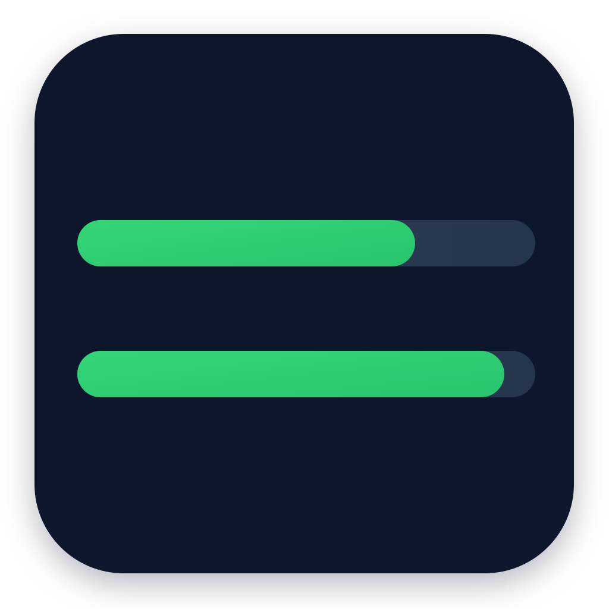

# Codex Meter

  

Codex Meter 是一個輕量的桌面小工具，用來快速查看本機 Codex CLI 的 usage / token 剩餘量。

它會透過你電腦上的 Codex CLI 查詢目前用量，不會讀取瀏覽器資料、不會爬取網頁，也不會儲存 OpenAI 帳號密碼。

主要用途：

- 在桌面上常駐顯示 Codex 每週剩餘用量。
- 顯示每週額度的剩餘百分比。
- 顯示額度重置時間與最後更新狀態。
- 可手動刷新目前用量。
- 視窗可以拖曳到螢幕任意位置。
- 可用圖釘按鈕切換置頂顯示。
- 會記住上次的置頂狀態與視窗位置。
