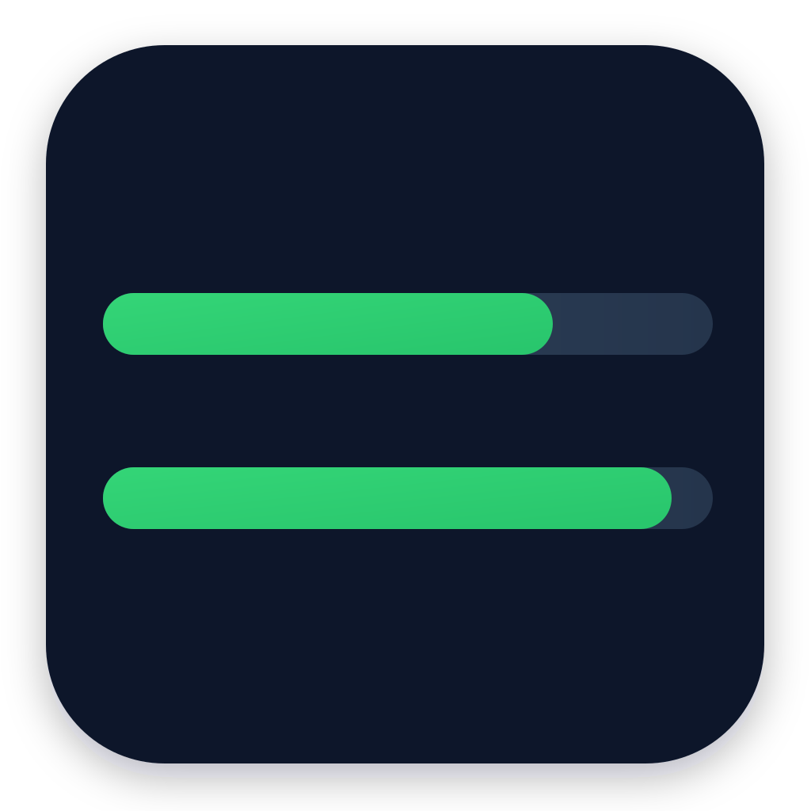

# Codex Meter

  

Codex Meter 是一個輕量的桌面小工具，用來快速查看本機 Codex CLI 的剩餘額度。

它會透過你電腦上的 Codex CLI 查詢目前用量，不會讀取瀏覽器資料、不會爬取網頁，也不會儲存 OpenAI 帳號密碼。

主要用途：

- 顯示 5 小時與每週額度的剩餘百分比及重置時間。
- 顯示額度重置時間與最後更新狀態。
- 可手動刷新目前用量。
- 視窗可以拖曳到螢幕任意位置。
- 可用圖釘按鈕切換置頂顯示。
- 會記住上次的置頂狀態與視窗位置。

點擊齒輪可設定 **Run Codex in**，選擇 **Local system** 或 **WSL (Windows)**。按下 **Save & refresh** 後會儲存選擇並立即查詢，其餘查詢設定使用預設值。

WSL 選項僅在 Windows 顯示，使用 WSL 預設發行版及 Linux 使用者。App 直接經由 `wsl.exe` 查詢 WSL Codex 的 `app-server`，沿用其登入，不需要 PowerShell 包裝腳本或複製登入檔。Linux 與 macOS 使用 **Local system** 模式。

WSL 模式會載入 Bash 的登入及互動環境以取得 PATH；啟動檔請避免向 stdout 輸出歡迎文字，以免干擾 App server 的 JSON 通訊。
